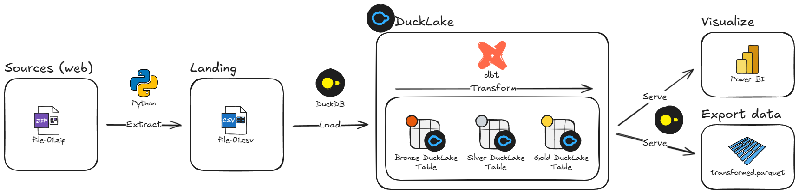

# DuckLake – Reference Data architecture for Small & Mid‑Size companies



**DuckLake** is an opinionated, end‑to‑end example that shows how you can combine  
**DuckDB + DuckLake + dbt + Python + Power BI** to build a production‑ready analytics stack on a single developer workstation.

The repository demonstrates:

| Capability | Technology | Where it happens |
|------------|------------|------------------|
| **Ingestion** from public (web) sources | Python (`uv`) | `ingestion/` |
| **Bronze / Silver / Gold tables** & automatic cataloging | DuckDB + DuckLake | `lakehouse/` |
| **SQL transformations, testing, docs** | dbt | `transformation/` |
| **Interactive exploration & serving** | DuckDB CLI / DuckDB UI | everywhere |
| **Self‑service BI** | Power BI (DuckDB connector) | outside repo |
| **One‑click pipeline run** | PowerShell (`run_pipeline.ps1`) | repo root |

---

## 1  Quick Start

> ### Prerequisites  
> * **Python ≥ 3.12**  
> * **git CLI** 
> * **DuckDB CLI** – `duckdb` must be on your PATH
>   ```powershell
>   # One‑liner install (Windows, PowerShell)
>   winget install DuckDB.cli
>   ```   
> * **uv** – lightning‑fast Python dependency manager  
>   ```powershell
>   # One‑liner install (Windows, PowerShell)
>   powershell -ExecutionPolicy ByPass -c "irm https://astral.sh/uv/install.ps1 | iex"
>   ```  
>   
> Tested on **Windows 10/11**. The stack is cross‑platform, so it should run on macOS/Linux as well – simply translate the PowerShell script into your shell of choice.

Powershell ≥6:
```powershell
git clone https://github.com/999999333/ducklake_elt_diabetes.git
cd ducklake_elt_diabetes
Set-ExecutionPolicy -Scope Process Bypass -Force
./run_pipeline.ps1          # grab a coffee ☕
```

The script performs the following:

1. Ensures **uv** is installed and syncs dependencies into a local **.venv**  
2. Executes ingestion scripts (`raw_download.py`, `ingest_dwh.py`)  
3. Activates the venv and runs **dbt run / docs / build**  
4. Starts the **DuckDB UI** so you can inspect the catalog  
5. Deactivates the venv and returns you to the starting directory  

When everything succeeds you'll see **✓ All steps completed successfully.**  
Hit **ENTER** and your lakehouse is ready to start querying!

### 1.1 Manual run (in case that you can't get `run_pipeline.ps1` working)
Download this git and unzip it somewhere (eg. your documents). Open CLI and navigate to that folder `cd`.. and then start running those commands, one by one 
```
uv sync
uv run ingestion/raw_download.py
uv run ingestion/ingest_dwh.py
./.venv/Scripts/activate
cd transformation
dbt run
dbt docs generate --static
start target/static_index.html
dbt build
cd ..
uv run ingestion/setup_duck_db.ui
duckdb -ui
```
---

## 2  Repository Layout

```
.
├── ingestion/               # Python ETL – extract raw → load bronze
│   ├── raw_download.py
│   ├── ingest_dwh.py
│   └── setup_duckdb_ui.py
├── lakehouse/               # DuckLake catalog, tables, raw data & helper SQL
├── transformation/          # dbt project (models, tests, docs)
├── docs/               # Docs, architecture diagrams & screenshots
├── run_pipeline.ps1         # one‑click orchestrator for Windows
└── pyproject.toml           # Python deps (managed by uv)
```

---


## 4  Working with the Data

### 4.1  Explore in DuckDB UI
```bash
duckdb -ui
```
After populatting (running orchestration powershell) open <http://localhost:4321> to browse tables, run ad‑hoc SQL, or export slices to Parquet / CSV.

### 4.2  Build & test in dbt
```bash
cd transformation
dbt run            # build Bronze→Silver→Gold
dbt build          # build + tests (expect one deliberate failing test 🙂)
dbt docs serve     # interactive lineage & docs site
```

---

## 5  Troubleshooting Guide

| Step         | Symptom                              | Suggested fix |
|--------------|--------------------------------------|---------------|
| `uv sync`    | Python version mismatch              | Upgrade Python / adjust `pyproject.toml` |
| `ingest_dwh` | Cannot open *.duckdb*                | Check path & file permissions |
| venv activate| Execution policy blocks scripts      | `Set-ExecutionPolicy -Scope Process Bypass` |
| `dbt run`    | Connection fails                     | `dbt debug` inside `transformation/` |
| `dbt build`  | Test fails                           | This is intentional – inspect the failing test to see dbt data quality in action |

The **run_pipeline.ps1** script prints friendly hints for each failure and never leaves your shell in a broken state.

---

## 6  Contributing

Open an issue or start a discussion if you have ideas, questions, or find a bug.  
Pull requests are warmly welcomed!

---

## 7  License

Licensed under the **MIT License** – see [`LICENSE`](LICENSE) for details.